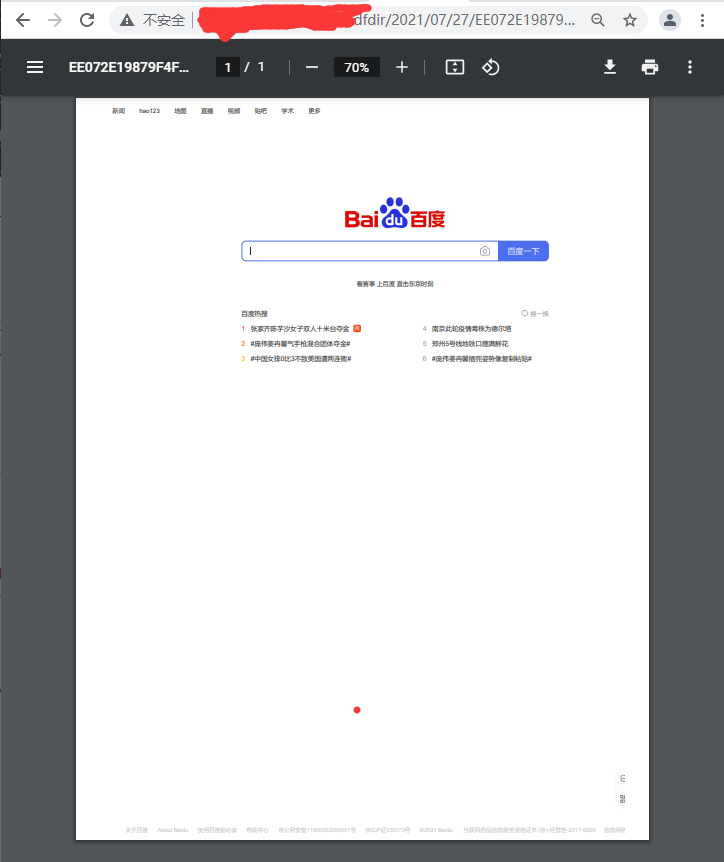

# 通用HTML转PDF

## 1.原理

直接利用chrome headless后台进行转换

## 2.前提条件

运行环境中必须安装chrome或chrome的可执行程序

## 3.基础实践

```bash
chrome --headless --disable-gpu --print-to-pdf=/root/aa.pdf  https://www.baidu.com
```

存在以下问题

> 1. 默认存在页面页脚
> 2. 无法修改目标尺寸

## 4.高级实践

1. 利用chromedp开源库，调用chrome生成pdf，该库主要用于爬虫及自动化测试，支持自定义页眉页脚，目标尺寸，是否打印背景色，边距调整

> chromedp开源库：<https://github.com/chromedp/chromedp>

2. 利用chromedp构建一个HttpServer，做一个网络版服务，【 go版本为:1.16.4】

> 源码地址：<https://github.com/nie312122330/niexq-pdf2html>
>
> 二进制下载：<https://github.com/nie312122330/niexq-pdf2html/releases/tag/1.0.0>

3. 转换效果

   

4. 包含两个http接口，都为POST请求

1. URL直接转换为PDF文件  <http://127.0.0.1:19444/niexq-html2pdf/pub/url2Pdf.do>

> 请求参数为:

```json
{
    "httpUrl":"https://www.baidu.com",
    "landscape":false,
    "displayHeaderFooter":false,
    "printBackground":true,
    "paperWidth":8.5,
    "paperHeight":11,
    "marginTop":0,
    "marginBottom":0,
    "marginLeft":0.4,
    "marginRight":0.4,
    "pageRanges":""
}
```

> 响应，响应的data字段就是生成的PDF文件，使用: <http://127.0.0.1:19444/{data}>就可直接访问

```json
{
  "code": 0,
  "msg": "",
  "count": 0,
  "pageCount": 0,
  "warn": "",
  "serverTime": "2021-07-27 07:48:54",
  "data": "pdfdir/2021/07/27/EE072E19879F4F7486A90318D4B47D8F.pdf",
  "extData": {}
}
```

2. html文本转换为PDF文件 
   <http://127.0.0.1:19444/niexq-html2pdf/pub/html2Pdf.do>

> 请求参数为:

```json
{
    "htmlTxt":"<!DOCTYPE html><html><body><h1> 聂xxxxx</h1></body></html>",
    "landscape":false,
    "displayHeaderFooter":false,
    "printBackground":true,
    "paperWidth":8.5,
    "paperHeight":11,
    "marginTop":0,
    "marginBottom":0,
    "marginLeft":0.4,
    "marginRight":0.4,
    "pageRanges":""
}
```

> 响应，响应的data字段就是生成的PDF文件，使用:<http://127.0.0.1:19444/{data}>就可直接访问

```json
{
  "code": 0,
  "msg": "",
  "count": 0,
  "pageCount": 0,
  "warn": "",
  "serverTime": "2021-07-27 07:48:54",
  "data": "pdfdir/2021/07/27/EE072E19879F4F7486A90318D4B47D8F.pdf",
  "extData": {}
}
```

## 5.容器化实践（CentOS）

1. 增加google-chrome-repo

```bash
tee /root/buildimages/google-chrome.repo <<-'EOF'
[google-chrome]
name=google-chrome
baseurl=http://dl.google.com/linux/chrome/rpm/stable/$basearch
enabled=1
gpgcheck=1
gpgkey=https://dl-ssl.google.com/linux/linux_signing_key.pub
EOF
```

2. 拷贝windows字体

> 1. 在/root/buildimages中建立文件夹 /root/buildimages/winfonts
> 2. 在windows上c:\windows\fonts中的所有文件到 /root/buildimages/winfonts

3. 拷贝引用程序

> 1. 拷贝pdf2html到 /root/buildimages/pdf2html
> 2. 修改app_conf.yaml文件中的 chromeConf.execPath 为: /usr/bin/google-chrome
> 3. 拷贝app_conf.yaml到 /root/buildimages/app_conf.yaml

4. 编写DockerFile

```bash
#编写DockerFile 
tee /root/buildimages/Dockerfile <<-'EOF'
FROM centos:7.9.2009

RUN curl -o /etc/yum.repos.d/CentOS-Base.repo http://mirrors.aliyun.com/repo/Centos-7.repo
RUN yum clean all;yum makecache
RUN yum install -y vim wget curl unzip openssh openssh-clients net-tools kde-l10n-Chinese glibc-common fontconfig
RUN echo Asia/Shanghai > /etc/timezone && localedef -c -f UTF-8 -i zh_CN zh_CN.utf8
ENV TZ=Asia/Shanghai
RUN ln -snf /usr/share/zoneinfo/$TZ /etc/localtime 

COPY google-chrome.repo  /etc/yum.repos.d/google-chrome.repo
WORKDIR /root
RUN yum install -y google-chrome-stable --nogpgcheck
#字体相关
RUN mkdir -p /usr/share/fonts/winfonts
COPY winfonts  /usr/share/fonts/winfonts
RUN chmod -R 755 /usr/share/fonts/winfonts
#安装 ttmkfdir 来搜索目录中的字体信息
RUN yum -y install ttmkfdir
RUN ttmkfdir -e /usr/share/X11/fonts/encodings/encodings.dir
RUN sed -i 's#<dir>/usr/share/fonts</dir>#<dir>/usr/share/fonts</dir>\n\t<dir>/usr/share/fonts/winfonts</dir>#g' /etc/fonts/fonts.conf
RUN fc-cache

#应用程序
COPY html2pdf  /root/
COPY app_conf.yaml  /root/app_conf.yaml
RUN chmod -R 777 /root/html2pdf

WORKDIR /root
CMD ["/root/html2pdf"]

EOF

#升级
tee /root/build-chromdp/Dockerfile <<-'EOF'
FROM registry.cn-chengdu.aliyuncs.com/width-public/html2pdf:v5
COPY html2pdf  /root/
COPY app_conf.yaml  /root/app_conf.yaml
RUN chmod -R 777 /root/html2pdf
WORKDIR /root
CMD ["/root/html2pdf"]
EOF

docker build -t registry.cn-chengdu.aliyuncs.com/width-public/html2pdf:v8 .
docker push  registry.cn-chengdu.aliyuncs.com/width-public/html2pdf:v8

docker stop html2pdf;docker rm html2pdf
docker run -d --restart=always --name html2pdf \
 -p 19444:19444 -m 1G  \
 -v /root/html2pdf/:/root/pdfdir \
registry.cn-chengdu.aliyuncs.com/width-public/html2pdf:v8


#统计总进程数
pstree -p |wc -l


```

5. 构建|测试|运行

```bash
#构建
cd /root/buildimages
docker build -t local/html2pdf:v1 .

#测试 
docker run -it --rm --name test  local/html2pdf:v1 /bin/bash 


#正式运行
docker run -d --restart=always --name html2pdf -p 19444:19444 local/html2pdf:v1


#调用
curl -X POST  -H "Content-Type: application/json;charset=\'UTF-8\'" -d '{"httpUrl":"https://www.baidu.com","landscape":false,"displayHeaderFooter":false,"printBackground":true,"paperWidth":8.5,"paperHeight":11,"marginTop":0,"marginBottom":0,"marginLeft":0.4,"marginRight":0.4,"pageRanges":""}' http://192.168.0.251:19444/niexq-html2pdf/pub/url2Pdf.do

#循环调用
for i in {1..5000}
 do
 curl -X POST  -H "Content-Type: application/json;charset=\'UTF-8\'" -d '{"httpUrl":"https://www.baidu.com","landscape":false,"displayHeaderFooter":false,"printBackground":true,"paperWidth":8.5,"paperHeight":11,"marginTop":0,"marginBottom":0,"marginLeft":0.4,"marginRight":0.4,"pageRanges":""}' http://192.168.0.253:19444/niexq-html2pdf/pub/url2Pdf.do
 done


 
```
